> 🚧 **Renewal in progress (2026.10)** — 이 저장소는 2026년 10월 리뉴얼되어 현재 개편 중입니다. / This repository was renewed in Oct 2026 and is currently being reorganized.

# facequiz-privacy

Public hosting for the privacy policy of **페이스 퀴즈 (Face Quiz)** — `com.dicetree.facequiz`.

얼굴 조각을 눈 깜빡임으로 붙여 관상을 완성하는 Android 게임. / An Android game where you blink to drop face parts into place and complete a "face reading".

### Screenshots (한국어)

  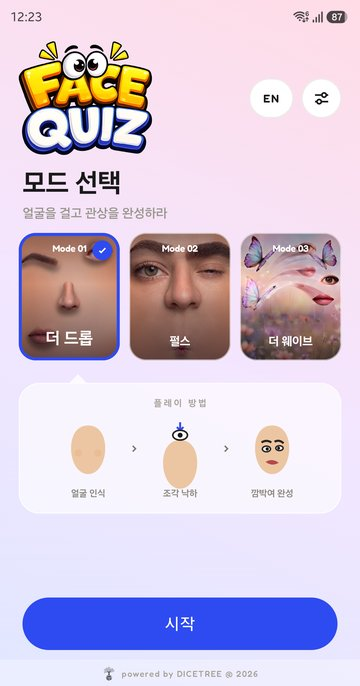
  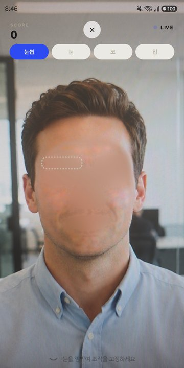
  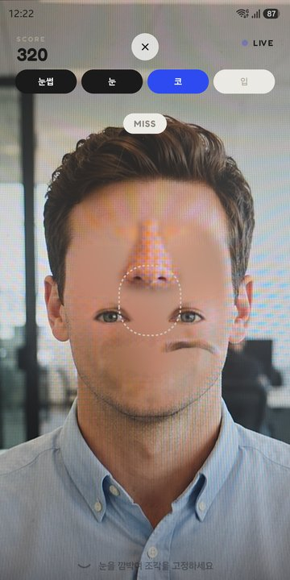
  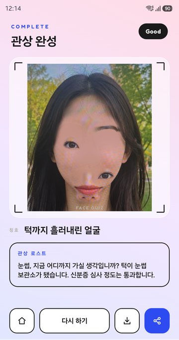
  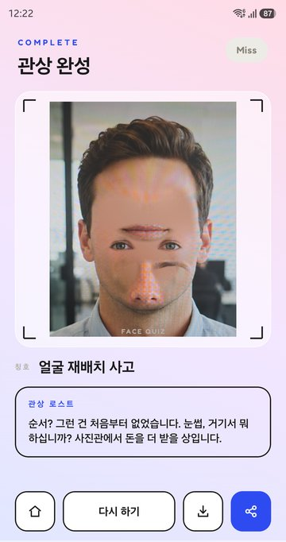
  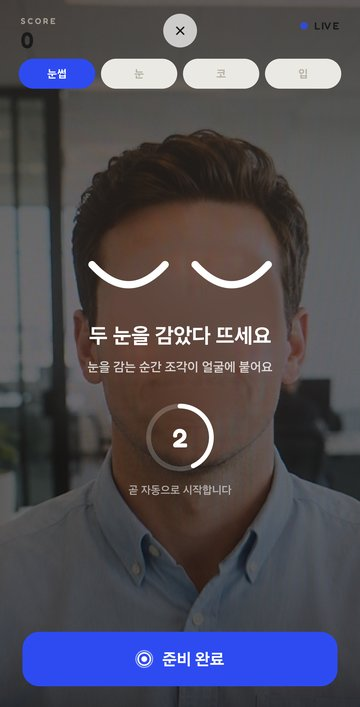

English

  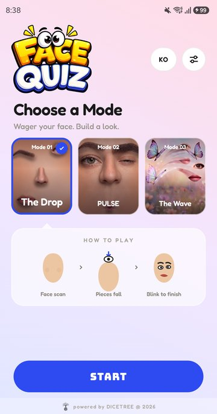
  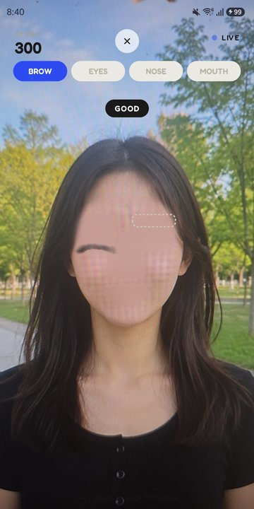
  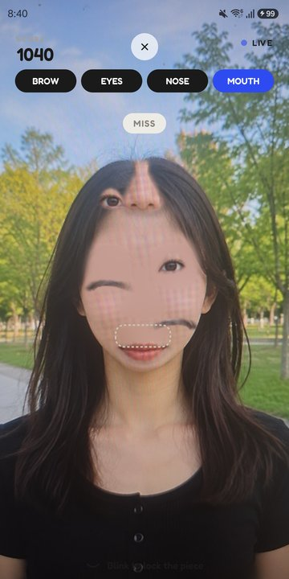
  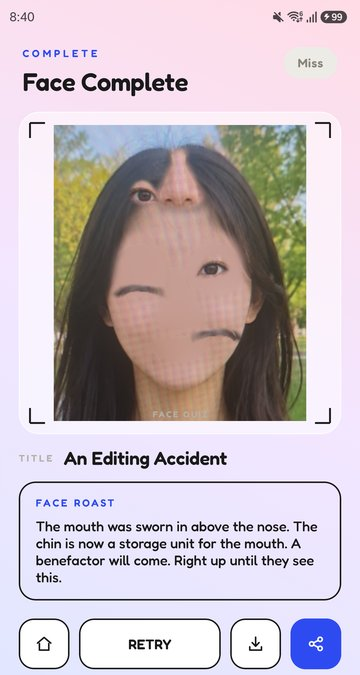
  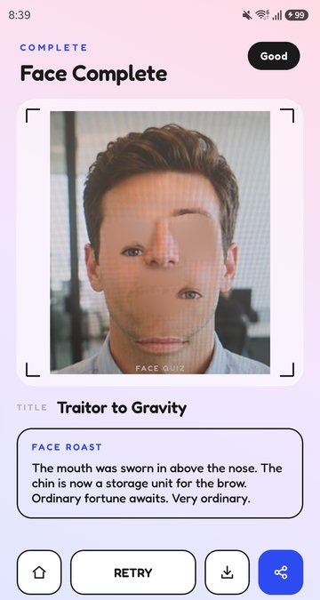
  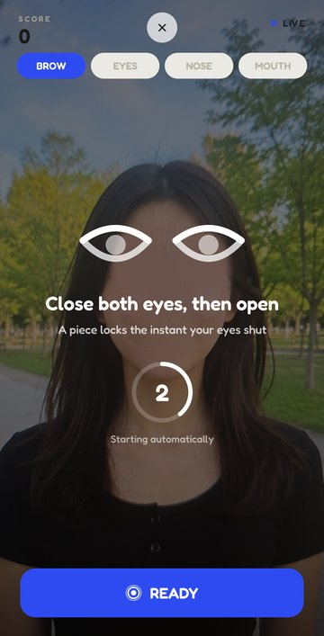

> Google Play 출시 예정 (coming soon).

**Published at:** https://jesus4000.github.io/facequiz-privacy/

This repository exists only to serve that one page. Google Play requires a privacy policy at a
publicly reachable URL that a reviewer can open in a browser without signing in, and the app's own
repository is private. Rather than make the app source public to get GitHub Pages, the policy lives
here on its own.

The authoritative source is `PRIVACY_POLICY.md` in the app repository, which also carries the Play
Console Data-safety answer table that this page has to stay consistent with. **Edit that file first,
then mirror the change here** — a policy page that disagrees with the Data-safety form is a review
rejection.
